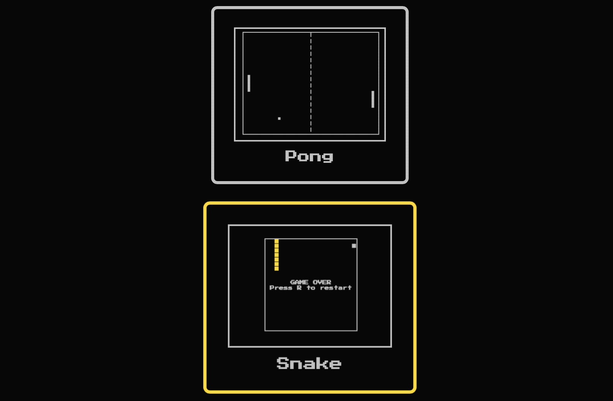

# Aksel-Arcade
 
A web-based game launcher.



---

## Directory structure

```t
Aksel-Arcade/
├── index.html          # Main menu (game selector)
├── css/
│   └── styles.css      # Global theme(s)
├── js/
│   └── main.js         # Menu handler
└── games/              # Self-contained game folders
    ├── snake/
    │   ├── index.html
    │   └── meta.json
    └── pong/
        ├── index.html
        └── meta.json
```

---

## How to add games

1. **Create a folder** under `games/` (use the game’s ID as the folder name).
2. Drop in:
   - `index.html`  – game entry point 
   - `game.js`     - game logic etc... 
   - `meta.json`   – menu metadata  
   - `thumb.png`   – 200 × 150 cover (optional)
3. Add a matching entry in `js/main.js`’s `games` array.
4. Serve locally (`python -m http.server`) and confirm the thumbnail and launch work. Press **ESC** in‑game to return to the lobby.
5. If your new game addition works and is correctly integrated you may open a pull request for the main branch.
